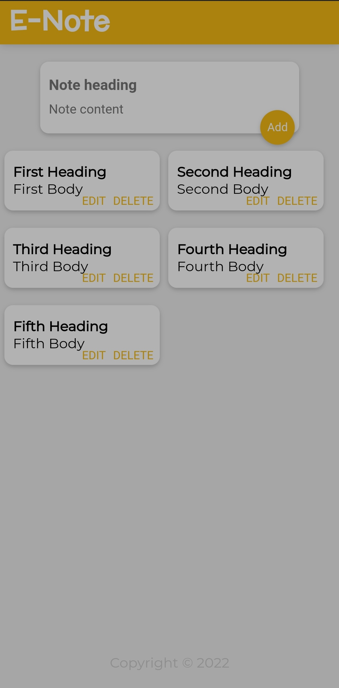

# E-Note With React js

After completing a react course, I decided to upgrade on it buy write some bit of codes. I made the edit and delete button to work and I can boldly say that I'm a React js developer.

## Authors

- [@Freecodextra](https://github.com/Freecodextra)


## 🚀 About Me
I'm a full stack developer. I'm good at front-end and back-end as well. I uses PHP and mySQL as back-end and vanilla JavaScript, and some JavaScript libraries and frameworks as front-end. working with couples. I'm hoping to land my first remote job very soon.
## Documentation

[Documentation](https://##Documentation)

This react app is my first react project. In this app, there are to input fields imported to App.jsx as a component from an input.jsx file.

The states of these input fields are monitored and can be held unto using the event.target property.
The input values are then added to the array of items, which is then re-rendered on the page.

With the use of React hook (useState), the app updates immediately a new object is added to the array of items.

Also, useRef is used to denote if the edit button was clicked so that the add button will only update the affected Note and won't add any object into the array.

This project has made me learnt a lot about React and I'm hoping to know more.

## Features

- Edit and Delete Notes
- Add New Note
- Update Existing Note

## Screenshots




## Appendix
Kindly give me a star. I'm hoping to work with pros in React js.


## Feedback

If you have any feedback, contribution or comment, please reach out to me at freecodextra@gmail.com or on Twitter @proff_official.


## 🛠 Skills
Javascript, HTML, CSS, PHP, mySQL, jQuery, Bootstrap, React...


## Support

For support, email
freecodextra@gmail.com
Or Twitter
@proff_official


## Usage/Examples

```function handleChange(e) {
    const {name, value}= e.target;
    if (name === "head") {
      setText(prev => {
        return {
          head: value,
          body: prev.body
        }
      })
    } else if (name === "body") {
      setText(prev => {
        return {
          head: prev.head,
          body: value
        }
      })
    }
  }